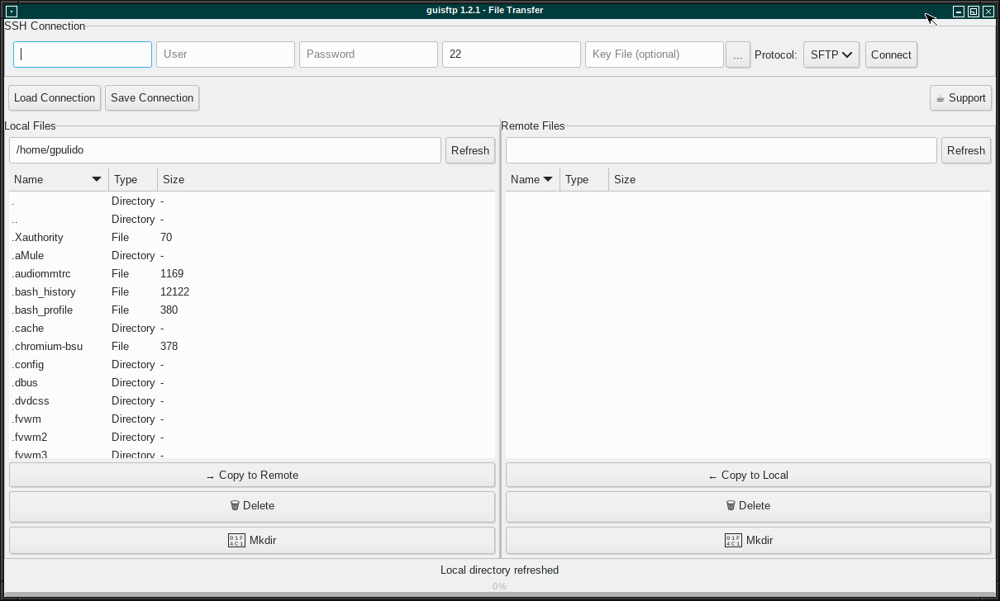

# guisftp
Linux SCP and SFTP GUI Client 
Copy files over SSH with a graphical interface. 

Based on GuiSFTP: https://github.com/RetoSchaedler/GuiSCP/tree/main
Renamed to guisftp because SCP is already obsolete and I dislike capital letters in app names.

Tested on Slackware Linux 15.0. 
 
Run: 
guiscp 

If you enjoy this software and want to support future updates, improvements, and new features, feel free to buy me a coffee. Your contribution helps keep the project alive and motivates continued development. 
Buy me a coffee: https://buymeacoffee.com/retos 

guisftp is an open source, lightweight, intuitive and fully native SCP/SFTP file transfer client for Linux.
Built as a modern alternative to WinSCP, guisftp focuses on simplicity, speed and reliability. With a polished dual-pane interface, it makes secure file transfers effortless — whether you’re managing servers, deploying code, or moving data between systems.
 
✔ Native Linux application (no Electron, no Java, no heavy dependencies) 
✔ Supports SCP & SFTP over SSH 
✔ SSH key authentication and passphrase-protected keys 
✔ Fast file uploads & downloads with progress indicators 
✔ Dual-pane interface for easy navigation 
✔ Folder creation and directory browsing 
✔ Designed for developers, sysadmins, and power users 
 
guisftp gives you the security and power of SSH with the convenience of a desktop GUI — lightweight, responsive, and built for Linux.
